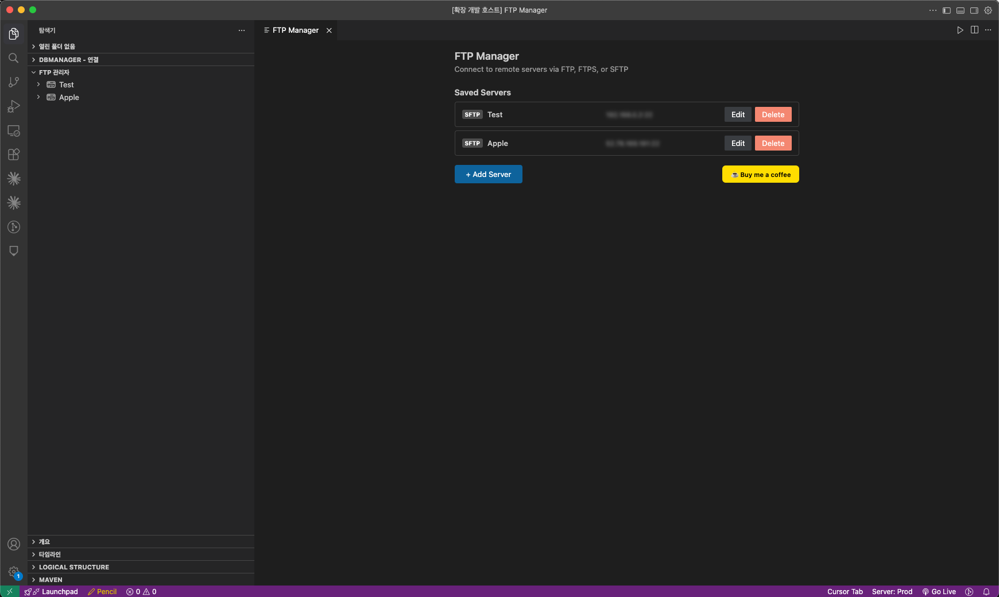
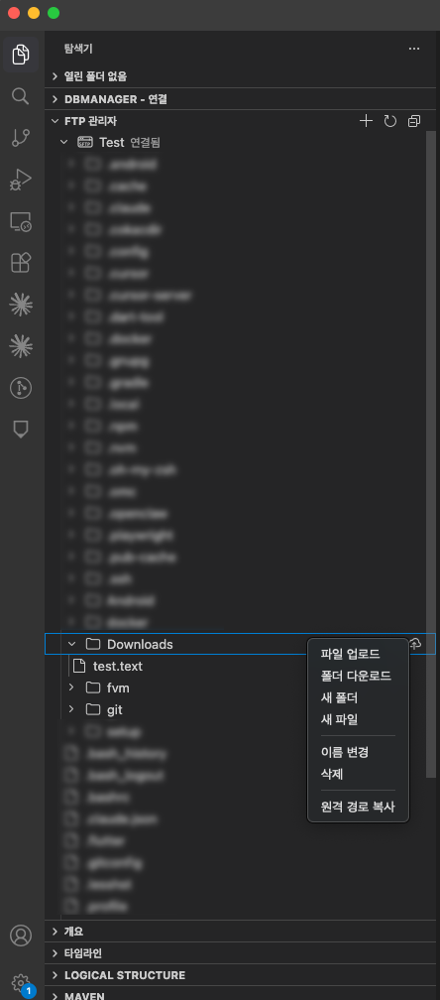

# FTPManager

[](https://marketplace.visualstudio.com/items?itemName=addios4u.ftpmanager)
[](https://marketplace.visualstudio.com/items?itemName=addios4u.ftpmanager)
[](https://marketplace.visualstudio.com/items?itemName=addios4u.ftpmanager)
[](https://marketplace.visualstudio.com/items?itemName=addios4u.ftpmanager)

**FTPManager** is a VS Code / Cursor extension that brings FTP, FTPS, and SFTP file management directly into your editor. Connect to remote servers, browse directories, edit files, and transfer data — all without leaving your IDE.



---

## Supported Protocols

| Protocol | Port | Driver | Notes |
|----------|------|--------|-------|
| FTP | 21 | `basic-ftp` | Standard FTP |
| FTPS | 21 | `basic-ftp` | FTP over TLS (implicit/explicit) |
| SFTP | 22 | `ssh2-sftp-client` | SSH File Transfer Protocol |

---

## Features

### Connection Management

- Save and manage multiple server connections
- **Add / Edit / Delete** servers via the sidebar panel
- **Test connection** before saving to verify settings
- Passwords stored securely in the **OS keychain** via VS Code SecretStorage
- **SSH key authentication** — private key file + passphrase for SFTP
- **Connection timeout** — 15-second timeout with cancellation support
- Automatic fallback to root `/` when configured remote path is unavailable

### Remote File Browser

Browse your remote server from the Explorer sidebar with a lazy-loading tree view.



```
FTP Manager
  └─ Server (FTP / FTPS / SFTP)
       ├─ Folder
       │    ├─ Subfolder
       │    └─ file.txt
       └─ document.pdf
```

- Separate icons for **FTP** and **SFTP** server types (light/dark theme aware)
- Drag-and-drop server reordering
- Context menus for every node level
- Refresh individual directories or entire server trees

### Remote File Editing

- Click any remote file to open it directly in the VS Code editor
- **Auto-upload on save** — edits are pushed back to the server when you press `Cmd+S` / `Ctrl+S`
- Powered by a custom `ftpmanager://` FileSystemProvider

### File Transfer

- **Upload** single files to a remote directory
- **Upload from Explorer** — right-click any local file and send it to a connected server
- **Download** individual files to a local folder
- **Download entire folders** recursively

### Remote File Operations

- **New Folder** — create directories on the remote server
- **Rename** — rename remote files and folders
- **Delete** — remove remote files and folders with confirmation
- **Copy Path** — copy the full remote path to clipboard

---

## Getting Started

1. Install **FTPManager** from the [VS Code Marketplace](https://marketplace.visualstudio.com/items?itemName=addios4u.ftpmanager).
2. Open the **Explorer** sidebar — you'll see the **FTP Manager** panel.
3. Click the **+** button to add a new server.
4. Fill in connection details (host, port, protocol, credentials), click **Test Connection**, then **Save**.
5. Click your saved server to connect and browse remote files.
6. Click any file to open and edit it — saving automatically uploads changes.
7. Right-click files or folders for upload, download, rename, delete, and more.

---

## Requirements

- VS Code 1.95+ or Cursor

---

## Development

```bash
# Install dependencies
pnpm install

# Build (shared → webview-ui → extension)
pnpm build

# Watch mode
pnpm dev

# Run tests
pnpm test

# Type check
pnpm typecheck

# Package .vsix
pnpm --filter ftpmanager package
```

Press **F5** in VS Code to launch the Extension Development Host.

### Tech Stack

| Layer | Technology |
|-------|------------|
| Extension host | TypeScript + VS Code Extension API |
| Webview UI | React 18 + Zustand |
| FTP/FTPS | basic-ftp |
| SFTP | ssh2-sftp-client |
| Build | esbuild (extension) + Vite (webview) |
| Test | Vitest |
| Package manager | pnpm workspaces (monorepo) |

---

## Support

If you find FTPManager useful, consider buying me a coffee!

[](https://buymeacoffee.com/addios4u)

---

## License

[MIT](LICENSE)
